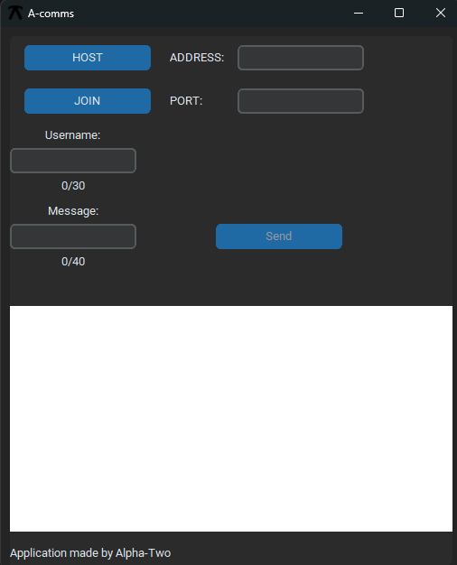

# a-comms

A simple communication program made with Python and CustomTkinter.

The program uses TCP networking to manage all connections. A host creates a server that other users can connect to and communicate through. Port forwarding is required to allow connections over the internet outside of a local network.

The `.exe` version does not require Python to be installed.

## Features

- TCP-based communication
- Host and join functionality
- Custom usernames
- Simple desktop interface
- Local network and internet connections (with port forwarding)

## Instructions

Usage should be fairly straightforward. You must enter a valid IP address, port, and username to host or join a server.

**Notice:** If no port is selected, the program will automatically use port `59000`.

### Hosting

To host a server, click **"HOST"**. You will automatically join your own server as well, meaning you do not need to open a separate application.

Afterwards, other users can join your server and communicate with you.

**Notice:** Port forwarding is required if you want users outside your local network to connect to your server.

### Joining

To join a server, the process is similar to hosting. Simply click **"JOIN"** and enter the server's IP address and port.

## Download

Download the latest version of A-comms here:

[Download the latest release](../../releases/latest)



## Running from source

If you want to run the source code directly, Python 3.13 is required:

https://www.python.org/

Install the required library:

```bash
pip install customtkinter
```
### Main.py
[⬇️ Download source code (.zip)](https://github.com/AlphaTwo2/a-comms/archive/refs/tags/v1.0.0.zip)


## Credits

This project uses:

- CustomTkinter by Tom Schimansky  
  Licensed under the MIT License.
  https://github.com/TomSchimansky/CustomTkinter
